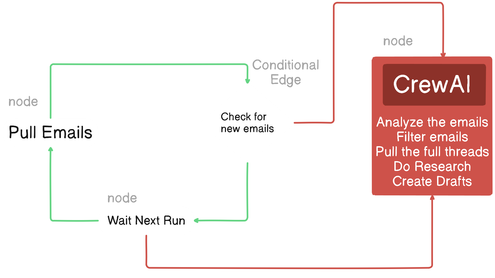

# LangGraph-CrewAI Gmail Workflow

This project is an educational implementation of an automated Gmail workflow using [CrewAI](https://github.com/crewAIInc/crewAI) and [LangGraph](https://github.com/langchain-ai/langgraph).<br> The workflow is inspired by the work of [@joaomdmoura](https://x.com/joaomdmoura) and the CrewAI + LangGraph integration example by CrewAI Inc.<br> It demonstrates how to build a stateful, agent-based system for processing and responding to emails using modern AI tools.
[CrewAI + LangGraph example](https://github.com/crewAIInc/crewAI-examples/tree/main/CrewAI-LangGraph)



## Features
- **Automated Gmail Monitoring:** Checks your Gmail inbox for new emails using the Gmail API.
- **Stateful Workflow:** Utilizes LangGraph's state machine to manage the flow between checking emails, drafting responses, and waiting for the next cycle.
- **Agent Collaboration:** Leverages CrewAI's agent/crew abstraction for collaborative email filtering and response drafting.
- **Environment Configuration:** Uses `.env` for API keys and user configuration.

## Project Structure
```
LangGraph-CrewAI/
├── crew/
│   ├── agents.py
│   ├── crew.py
│   ├── tasks.py
│   └── tools.py
├── credentials.json
├── graph.py
├── main.py
├── nodes.py
├── requirements.txt
├── state.py
├── .env
├── .gitignore
└── README.md
```

## Setup Instructions

### 1. Clone the Repository
```sh
git clone <this-repo-url>
cd LangGraph-CrewAI
```

### 2. Install Dependencies
It is recommended to use a virtual environment:
```sh
python -m venv venv
venv\Scripts\activate  # On Windows
# or
source venv/bin/activate  # On macOS/Linux
pip install -r requirements.txt
```

### 3. Configure Environment Variables
Create a `.env` file in the root directory with the following content (see `.env.example` if provided):
```
GOOGLE_API_KEY=your_google_api_key
TAVILY_API_KEY=your_tavily_api_key
MY_EMAIL=your_email@gmail.com
```

### 4. Set Up Google API Credentials
- Download your `credentials.json` from the [Google Cloud Console](https://console.cloud.google.com/apis/credentials).
- Place it in the project root.
- The first run will prompt you to authenticate and create a `token.json` file.

### 5. Run the Workflow
```sh
python main.py
```

The workflow will check your Gmail inbox, process new emails, and (optionally) draft responses using CrewAI agents.

## Credits & License
- **CrewAI + LangGraph integration:** [CrewAI Inc GitHub](https://github.com/crewAIInc/crewAI)
- **CrewAI + LangGraph example:** [CrewAI + LangGraph example](https://github.com/crewAIInc/crewAI-examples/tree/main/CrewAI-LangGraph)
- **Workflow inspired by:** [@joaomdmoura](https://x.com/joaomdmoura)
- **Educational Use:** This project is for educational purposes only.
- **License:** This project is released under the MIT License. See [LICENSE](LICENSE) for details.
